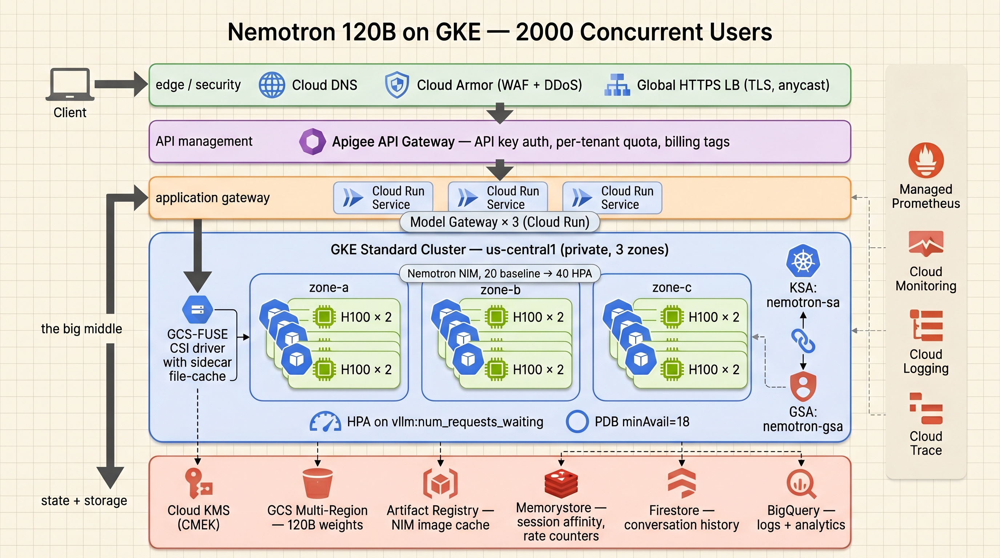
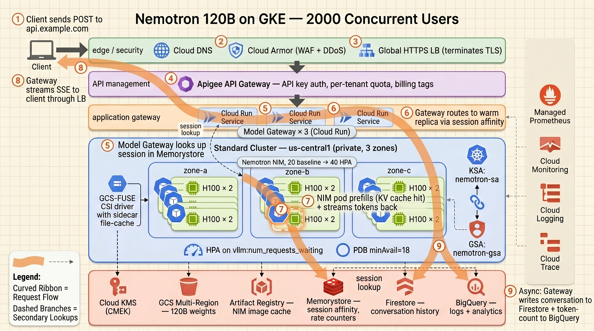
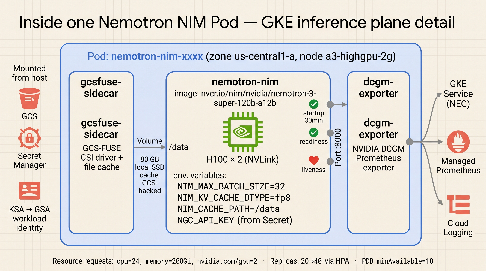
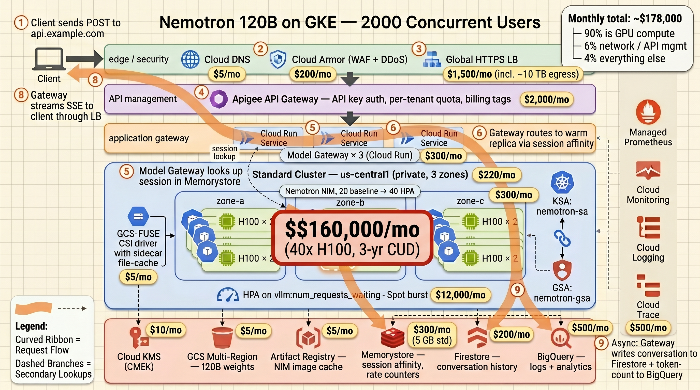

# Production Architecture: Nemotron 120B on GKE for 2,000 Concurrent Users

**Status:** Design proposal
**Last updated:** 2026-05-22
**Audience:** Engineering, Architecture Review, FinOps

## Executive Summary

This document specifies a production deployment of NVIDIA Nemotron-3 Super 120B-A12B (NVFP4 quantization) on Google Kubernetes Engine, sized for 2,000 concurrent active sessions (~200 RPS sustained, ~600 RPS peak burst). The architecture spans six logical layers from edge to data plane, leverages eight GCP services beyond GKE, and is projected at ~$178K/month with 3-year committed-use discounts. Single-region in us-central1 with 3-zone HA; multi-region expansion is documented as a future increment.

## Scope and Assumptions

**In scope**

- Single-region deployment in us-central1, multi-zone (a, b, c) for HA
- B2B API access pattern, per-tenant API keys
- Streaming SSE responses (OpenAI-compatible `/v1/chat/completions`)
- NIM as the inference framework (assumes NVIDIA AI Enterprise entitlement on the NGC org)
- 2,000 concurrent active sessions with the following workload shape:
  - ~1 request per 10 seconds per session → 200 RPS sustained, 600 RPS peak
  - Prompts averaging 500 tokens, completions averaging 200 tokens
  - Conversation context typically 4–8K tokens
  - Multi-turn sessions favored (KV-cache reuse matters)

**Out of scope** (documented as future increments)

- Multi-region active-active
- Disaggregated prefill/decode pods (vLLM 0.6+ pattern)
- Per-tenant fine-tuned LoRA variants
- TCO comparison vs. Vertex AI Model Garden managed endpoint

## Per-Replica Capacity Model

The basic unit of capacity is a single pod requesting 2× H100 80GB (NVLink-connected on an `a3-highgpu-2g` node).

| VRAM budget item | GB |
|---|---|
| Nemotron-3 120B weights (NVFP4 = 4-bit) | 60 |
| Framework + activations + scratch | ~15 |
| **KV-cache budget** | **~85** |
| Per-sequence at 8K context, FP8 KV | ~5 |
| **Sustainable concurrent sequences per replica** | **~16–24** |
| Aggregate decode throughput | ~1500–2500 tok/s |
| Sustained RPS at 200-token completion | **~8–12 RPS** |

To meet 200 RPS sustained at safe utilization, **20 replicas** is the baseline; **40 replicas** is the peak via HPA. Total GPU footprint: 40–80× H100.

## Architecture Overview

*Figure 1: Top-down architecture, six layers. Primary request flow is top-to-bottom. State stores and observability are connected via secondary dashed lines.*

## Component-by-Component Breakdown

### Layer 1 — Edge / Security

**Cloud DNS** resolves `api.example.com` to the global LB's anycast VIP.

**Cloud Armor** policies applied at the edge:
- Per-IP rate limiting (default 100 req/s)
- WAF rules from the OWASP top-10 ruleset
- Adaptive Protection enabled for L7 DDoS
- Known-bot signature blocking

**Global External HTTPS Load Balancer** terminates TLS via Certificate Manager managed certs, supports HTTP/2 and HTTP/3, and routes by hostname/path to the API management layer. The global LB (vs. a regional LB) is chosen for anycast latency benefits, free DDoS scrubbing, and trivial multi-region expansion later.

### Layer 2 — API Management

**Apigee X** handles tenant-level concerns:
- API key validation
- Per-tenant quotas (e.g., free 100 req/min, pro 10K req/min)
- Spike arrest so one tenant cannot starve others
- Request logging to BigQuery for cost attribution and abuse detection

Apigee is deliberately separated from the Model Gateway (Layer 3) to keep policy concerns separate from routing concerns. A cheaper substitute is **Cloud API Gateway** (managed Envoy); Apigee earns its cost when you have 10+ tenants with differentiated SLAs.

### Layer 3 — Model Gateway (Cloud Run)

Three always-on Cloud Run instances behind an internal LB, autoscaling further on demand. This layer is the most consequential deviation from a "GKE Service + LoadBalancer" baseline and is responsible for:

- **SSE / WebSocket proxying** — long-lived streaming connections held here, not on a GPU pod, so inference pods stay focused on compute
- **Session-affinity routing** — looks up `(tenant_id, session_id)` in Memorystore Redis; routes to the warm replica with the matching KV-cache prefix
- **Prompt shaping** — enforces `max_tokens` caps, injects required system prompts, applies safety filters
- **Cost tracking** — counts input/output tokens per request, publishes to Pub/Sub → BigQuery
- **Cancellation handling** — propagates client disconnects to NIM as in-flight aborts

The OSS alternative is **Envoy AI Gateway**, which provides similar functionality with more features at higher operational cost.

### Layer 4 — Inference Plane (GKE Standard, private)

**Cluster topology**

- Regional GKE Standard cluster (control plane is GKE-managed)
- Private nodes (no public IPs), control plane access via authorized networks + IAP tunnel
- Workload Identity enabled

**Node pools**

- `system-pool`: 3× `e2-standard-4` across 3 zones for system pods, gateway proxies, daemonsets
- `gpu-pool`: `a3-highgpu-2g` nodes (2× H100 each), 1 inference pod per node. Autoscales 20→40 nodes across 3 zones. NVIDIA driver installed via the `nvidia-driver-installer` DaemonSet
- `gpu-spot-pool` (optional): same SKU with `--spot`, autoscales 0→20 for burst capacity

**Inference workload**

- **Deployment**: 20 baseline NIM pods, each requesting 2× H100
- **HPA**: scales on `vllm:num_requests_waiting` (queue depth) via Managed Prometheus + custom-metrics adapter. Target: queue depth < 4 per replica. **CPU-based HPA does not work for GPU pods** — they appear idle on CPU even at full GPU saturation.
- **PodDisruptionBudget**: `minAvailable: 18` ensures rolling updates and node upgrades never drop below 90% of baseline capacity
- **Topology spread**: required across 3 zones, ≥6 replicas per zone
- **Service**: ClusterIP exposed via Network Endpoint Group (NEG) so the Cloud Run gateway targets pod IPs directly
- **Weights**: GCS-FUSE CSI driver with file-cache sidecar; ~80 GB local SSD per node so warm replicas don't re-read from GCS

### Layer 5 — State and Storage

| Component | Purpose | Sizing |
|---|---|---|
| **GCS multi-regional bucket** | Model weights, versioned, CMEK-encrypted | ~60 GB per model version, keep last 3 |
| **Memorystore (Redis Standard)** | Session→replica routing hints, per-tenant rate counters, idempotency keys | 5 GB |
| **Firestore** | Durable conversation history per tenant | Per-tenant document model |
| **BigQuery** | Long-term sink for request logs (Apigee) and telemetry (Cloud Logging) | Cost attribution, prompt analytics, abuse detection |
| **Artifact Registry** | Intra-region cached copy of NIM container image | Critical for fast pod startup on scale-up |
| **Cloud KMS** | CMEK keys for weights bucket and Firestore | Compliance for enterprise tenants |

### Layer 6 — Observability

- **Managed Service for Prometheus (GMP)** scrapes `vllm:*` metrics and DCGM-exporter (GPU utilization, HBM, temperature) from every pod; federates into Cloud Monitoring
- **Cloud Monitoring** dashboards: GPU utilization, HBM usage, KV-cache fill, p50/p95/p99 first-token and per-token latency, queue depth, cost per 1K tokens (joined with BigQuery billing)
- **Cloud Logging** with BigQuery sink for analytics
- **Cloud Trace** for end-to-end request tracing with token counts in span attributes
- **SLOs** (target):
  - p95 first-token latency < 2s
  - p99 inter-token latency < 100 ms
  - Monthly availability > 99.9%
- **Alerts**: queue-depth-high (precedes saturation), pod restart rate, p99 latency breach, GPU OOM, daily cost overrun

### Cross-Cutting — Secrets and Identity

- **Secret Manager** holds the NGC API key, HF token, tenant-specific secrets. Pods read via the Secret Manager CSI driver. Rotation = Secret Manager version bump, not a redeploy.
- **Workload Identity** binding: KSA `nemotron-sa` → GSA `nemotron-gsa@<project>.iam.gserviceaccount.com`. GSA holds `roles/storage.objectUser` on the weights bucket and `roles/secretmanager.secretAccessor` on the secret set.
- **Cloud KMS** CMEK keys for weights and conversation history.

### Cross-Cutting — Networking

- Single regional VPC, three zone-subnets in us-central1
- Private GKE cluster (nodes without public IPs)
- **Cloud NAT** for egress (NIM image pulls before Artifact Registry cache, weights bucket cold reads)
- **Private Service Connect** for pod access to Memorystore, Firestore, Secret Manager over private IPs
- **VPC Service Controls** perimeter around weights bucket and Secret Manager to prevent exfiltration even from a compromised pod

### Cross-Cutting — CI/CD

- **Cloud Build** (or GitHub Actions with Workload Identity Federation) on push to `main` builds and pushes the Model Gateway image to Artifact Registry
- **Cloud Deploy** orchestrates progressive rollout:
  1. **Canary**: 1 GKE replica with new image, 5% traffic via gateway header
  2. **Soak**: 10% traffic for 30 minutes, watching p95 latency
  3. **Rollout**: 100% via rolling update, respecting PDB
- **Model weight updates** treated as a release: separate pipeline, manual approval gate, blue/green at the Service label level (two Deployments, switch selectors)

## Request Lifecycle

*Figure 2: End-to-end request lifecycle. Curved orange ribbon = primary request flow; dashed branches = secondary lookups and async writes.*

1. **Client → Cloud DNS**: `POST https://api.example.com/v1/chat/completions` with `Authorization: Bearer <api-key>`. DNS returns the LB VIP.
2. **Cloud Armor**: rate-limit check, WAF inspection, bot-signature match. Pass.
3. **Global HTTPS LB**: TLS termination, routes to Apigee backend.
4. **Apigee**: validates API key, checks tenant quota, attaches `X-Tenant-ID` header, forwards.
5. **Model Gateway**: looks up `(tenant_id, session_id)` in Memorystore. On hit, attaches `X-Replica-Hint` header. Sends to GKE Service via NEG.
6. **GKE Service**: header-based session affinity routes to the warm replica.
7. **NIM pod**: KV-cache prefix hit → fast prefill. Decode begins, streaming tokens.
8. **Stream return path**: tokens flow back through Cloud Run → Apigee → LB → client. Cloud Run holds the long-lived SSE connection.
9. **Async finalization**: Cloud Run publishes token-count to Pub/Sub → BigQuery, writes conversation message to Firestore, refreshes Memorystore session TTL.

**End-to-end performance targets**: p95 first token < 800 ms, p95 inter-token < 80 ms, p95 full 200-token completion < 10 s.

## Inference Pod Detail

*Figure 3: Inside one inference pod. Three containers, one purpose each. Critical environment variables and probe wiring shown explicitly.*

**Container 1 — `nemotron-nim`** (the inference engine)

- Image: `nvcr.io/nim/nvidia/nemotron-3-super-120b-a12b:1.8.0-variant`
- Resource requests/limits: `cpu=24, memory=200Gi, nvidia.com/gpu=2`
- Environment:
  - `NIM_MAX_BATCH_SIZE=32`
  - `NIM_KV_CACHE_DTYPE=fp8`
  - `NIM_CACHE_PATH=/data`
  - `NGC_API_KEY` from Secret Manager (via CSI driver)
- Probes:
  - `startupProbe`: 30-minute grace for initial weight load
  - `readinessProbe`: `/v1/health/ready` every 10s
  - `livenessProbe`: `/v1/health/live` every 30s
- Port `8000` (OpenAI-compatible API)

**Container 2 — `gcsfuse-sidecar`** (weight backing store)

- GCS-FUSE CSI driver with file-cache enabled
- 80 GB local SSD cache, GCS-backed
- Mounts `/data` into `nemotron-nim`

**Container 3 — `dcgm-exporter`** (GPU telemetry)

- NVIDIA DCGM Prometheus exporter
- Port `9400` scraped by Managed Prometheus
- Exposes GPU utilization, HBM usage, temperature, power, ECC errors

## Failure Modes

| Failure | Blast radius | Mitigation |
|---|---|---|
| Single-zone outage | -33% capacity | HPA scales remaining zones; topology spread ensures pods are spread across all 3 |
| Pod OOM | 1 replica restarts | PDB limits concurrent unavailability; HPA backfills |
| NIM image revision regresses | Caught at canary | Cloud Deploy SLO-gated rollout; auto-rollback |
| Memorystore outage | Lose session affinity; fall back to consistent hashing | Worse cache-hit latency, not an outage |
| Apigee outage | Full edge outage at the gateway tier | Apigee SLA 99.95%; documented degraded-mode bypass via Cloud Run gateway |
| NGC entitlement lapse | New nodes fail image pull | Artifact Registry cache keeps existing replicas alive; alerts fire on first failed pull |
| Spot preemption surge | Burst capacity loss | Baseline 20 replicas on-demand; spot is purely additive |
| Cost overrun | Budget pain, not outage | Budget alerts + automated max-replica caps |

## Cost Distribution

*Figure 4: Cost overlay on the architecture, in monthly USD with 3-year CUDs applied where available. The GPU pool dominates at 90% of total spend; every other component combined is the remaining 10%.*

The visual makes one strategic point that the table that follows reinforces numerically: **this is a GPU-cost optimization problem, not a multi-service optimization problem**. Any cost-reduction effort that doesn't move the GPU line item is rounding error.

## Capacity and Cost Summary

| Component | Quantity | Monthly cost |
|---|---|---|
| GKE Standard cluster (regional, private) | 1 | ~$220 |
| GPU baseline: 40× H100 (20 replicas × 2 GPUs), 3-yr CUD | 40 | **~$160,000** |
| Spot burst (avg 20 GPUs × 200 hr/mo) | variable | ~$12,000 |
| System node pool (3× e2-standard-4) | 3 | ~$300 |
| Apigee X (Enterprise tier) | 1 | ~$2,000 |
| Cloud Run (Model Gateway, 3 instances always-on) | 3 | ~$300 |
| Memorystore Standard 5GB | 1 | ~$300 |
| Firestore (1M reads/day, 100K writes/day) | — | ~$200 |
| BigQuery (500 GB storage + queries) | — | ~$500 |
| GCS multi-regional (weights bucket) | 60 GB | ~$2 |
| Artifact Registry (image cache, 50 GB) | — | ~$5 |
| Cloud LB + Cloud Armor + egress (~10 TB/mo) | — | ~$1,500 |
| Cloud Monitoring/Logging/Trace | — | ~$500 |
| **Realistic monthly total** | | **~$178,000** |

### Cost Levers (in priority order of impact)

1. **Model size** — Nemotron Llama-3.1-70B on 1× H100 reduces per-replica GPU cost by ~75%. Single biggest lever if the smaller model meets quality requirements.
2. **CUD term** — 3-year CUD is ~50% off on-demand; 1-year is ~30% off. Tradeoff: commitment risk vs. cost.
3. **Spot/preemptible mix** — 60–91% off list, but pre-emption is rough on warm KV caches. Best used for elastic burst capacity, not baseline.
4. **Per-tenant rate caps** — caps the demand side; less effective once you've committed to baseline capacity.
5. **Disaggregated prefill/decode** — 20–40% throughput gain per GPU at high concurrency. Operationally expensive; revisit at 1,000+ RPS.

## What This Design Buys vs. Baseline

A naïve "GKE + Service + LoadBalancer" deployment costs less in dollars but fails on these axes:

1. **Per-tenant isolation** — quota enforcement and cost attribution per tenant
2. **Streaming-native** — SSE long-poll handled by Cloud Run, not GPU pods
3. **KV-cache reuse** — session-affinity routing recovers 20–40% latency on multi-turn chat
4. **Graceful degradation** — every layer has a fallback; no single failure takes the system down
5. **Cost observability** — BigQuery-backed per-tenant cost reporting
6. **Enterprise security posture** — VPC-SC, Workload Identity, CMEK, IAP — passes procurement

## What's NOT in This Design

Documented as future increments, with the trigger conditions that would justify each:

- **Multi-region active-active** — trigger: 10,000+ concurrent users or strict cross-continent latency SLA. Requires Spanner instead of Firestore, multi-region GCS, regional GKE clusters, Cloud LB cross-region failover.
- **Disaggregated prefill/decode** — trigger: > 1,000 RPS sustained. Splits inference into prefill-only and decode-only pod fleets for 20–40% throughput gain. Doubles operational surface.
- **Per-tenant LoRA variants** — trigger: enterprise tenants demanding fine-tuned model behavior. Requires a more sophisticated routing layer keyed on tenant ID.
- **Vertex AI Model Garden comparison** — Vertex offers Nemotron as a managed endpoint; TCO comparison worth running before committing to self-hosted at this scale.

## Open Questions

1. Should we use Apigee X or the cheaper Cloud API Gateway? Decision hinges on tenant count and SLA differentiation.
2. Is the 3-year CUD commitment acceptable, or should we plan for 1-year + spot mix?
3. Do we have NVAIE entitlement on the NGC org? Required for the 120B NIM container; blocks deployment if not.
4. Is the existing GKE manifest generator extended to emit this topology, or is the production deployment authored separately? **(Decided: separate — this repo.)**

## Appendix: Generator Gaps

The existing [nemotron-on-gke](https://github.com/adnanfida/nemotron-on-gke) generator produces a single-pod-single-Deployment baseline. To produce manifests aligned with this design, the generator would need:

- vLLM/NIM concurrency knobs (`--max-num-seqs`, `--enable-prefix-caching`, `--kv-cache-dtype fp8`, `NIM_MAX_BATCH_SIZE`)
- HPA on custom Prometheus metric instead of CPU
- Session-affinity annotation on the Service
- Multi-zone node pool flag (`--node-locations=...`)
- PDB `minAvailable` scaled to replica count
- Secret Manager CSI integration replacing the `kubectl create secret` step

These changes are scoped at 1–2 days of generator work each, except the HPA-on-Prometheus change which has external dependencies (operator must install a metrics adapter).

The decision (per Open Question 4) is **not** to evolve the generator into this — keep it as an exploration tool. This repo holds the production IaC instead.
